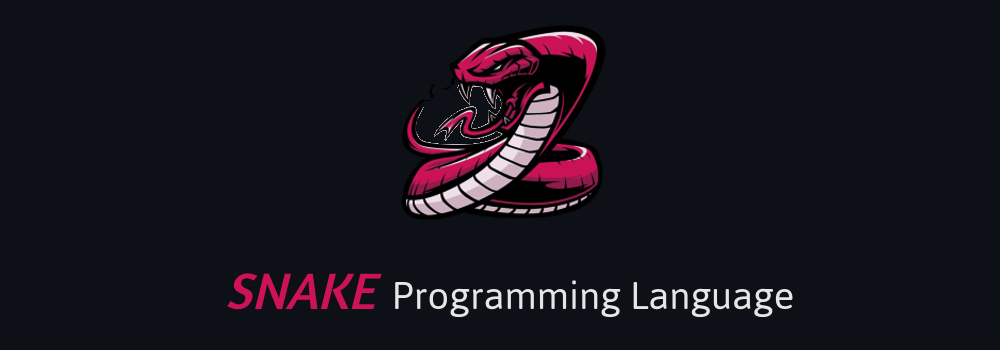

[](https://opensource.org/licenses/MIT)



SNAKE is a Concatenative Stack-Oriented Programming Language for Computers.
This will be updated soon

## What is a Stack-based programming language?

A stack-based programming language is a language that uses a stack to store and manipulate data during program execution. The stack is a data structure that operates on the Last-In-First-Out (LIFO) principle, that is, the last element inserted into the stack is the first to be removed.

This approach is commonly used in functional programming languages, such as the Forth language and HP's RPL language, which are designed for programming on HP calculators. It is also commonly used in other programming languages, such as PostScript and assembly.

A stack-based programming language is useful in situations where the execution stack is a natural and efficient way to store and manipulate data. For example, it can be used to simplify the implementation of mathematical calculations, which involve a series of operations that are performed on a stack of data. In addition, the stack approach can be used to simplify the flow control of a program, since the stack manipulation can be used to control the execution of subroutines and loops in a very efficient way.

**WARNING! THIS LANGUAGE IS A WORK IN PROGRESS! ANYTHING CAN CHANGE AT ANY MOMENT WITHOUT ANY NOTICE! USE THIS LANGUAGE AT YOUR OWN RISK!**

## Main characteristics
- [x] Compiled
- [x] Native
- [x] Stack-based (just like Forth)
- [ ] Turing-complete (yes, the development is at such an early stage that this thing is not even Turing complete yet)
- [ ] Statically typed (the type checking is probably gonna be similar to the [WASM validation](https://binji.github.io/posts/webassembly-type-checking/))
- [ ] Self-hosted (Python is used only as an initial bootstrap, once the language is mature enough we gonna rewrite it in itself)

## Quick Start
```sh
$ git clone https://github.com/rexionmars/snake-lang.git
```
```sh
$ cd snake-lang
```

## Folder Structure
```lua
docs/
  |
  +-- Documentations and references
  
dump.c
  |
  +-- Dump implementation
  
examples/
  |
  +-- This folder contains examples of programs made in SNAKE
  
snake.py
  |
  +-- This file is the principal and contain base functions
  
outdir/
  |
  +-- This folder contains output x86_64 binary generated
      from assembly

```
## SNAKE usage
Sanake has two modes of operation, the first mode to Simulate the program, and the second mode to Compile the program.<br><br>
SNAKE without parameters returns the help menu
```sh
$ ./snake.py
```
simulate program
```sh
$ ./snake.py --preview <args>
```
or compile the program
```sh
$ ./snake.py --compile <args>
```
this will generate an x86_64 Linux executable, in the tests folder
```sh
$ cd tests && ./output
```
## Your first Hello World in SNAKE
A simple example using PUSH, PLUS, MINUS, DUMP<br>
Use your favorite editor, i love neovim
```sh
$ nvim sun.snake
```
Example 1: sun two numbers
```sh
49 99 + .
```
Example 2: subtrac two numbers
```sh
13 9 - .
```

## Basics Operations
| OPERATIONS | SYMBOL | ACTION |
|------------|--------|--------|
|    PLUS    |    +   |   SUN  |
|    PUSH    |        |   PUSH |
|    MINUS   |    -   |   SUB  |
|    DUMP    |    .   |   DUMP |

**WARNING! THIS LANGUAGE IS A WORK IN PROGRESS! ANYTHING CAN CHANGE AT ANY MOMENT WITHOUT ANY NOTICE! USE THIS LANGUAGE AT YOUR OWN RISK!**
