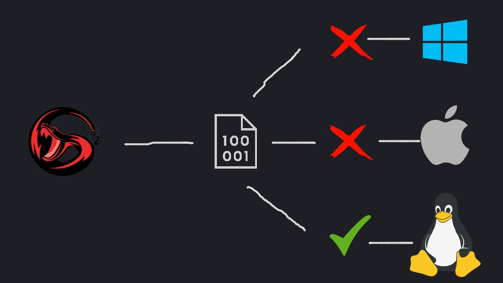

[](https://opensource.org/licenses/MIT)


SNAKE is a Concatenative Stack-Oriented Programming Language.
This will be updated soon

## What is a Stack-based programming language?

A stack-based programming language is a language that uses a stack to store and manipulate data during program execution. The stack is a data structure that operates on the Last-In-First-Out (LIFO) principle, that is, the last element inserted into the stack is the first to be removed.

This approach is commonly used in functional programming languages, such as the Forth language and HP's RPL language, which are designed for programming on HP calculators. It is also commonly used in other programming languages, such as PostScript and assembly.

A stack-based programming language is useful in situations where the execution stack is a natural and efficient way to store and manipulate data. For example, it can be used to simplify the implementation of mathematical calculations, which involve a series of operations that are performed on a stack of data. In addition, the stack approach can be used to simplify the flow control of a program, since the stack manipulation can be used to control the execution of subroutines and loops in a very efficient way.

<!-- ## Compilation target for platforms
 -->

## Main characteristics
- [x] Compiled
- [x] Native
- [x] Stack-based

## Quick Start
```sh
$ git clone https://github.com/rexionmars/snake.git
```
```sh
$ cd snake
```

## Folder Structure
```lua
docs/
  |
  +-- Documentations and references
  
container/
  |
  +-- Standard Library for scripts (temporary)
  
examples/
  |
  +-- This folder contains examples of programs made in SNAKE
  
snake.py
  |
  +-- This file is the principal and contain base functions
  
outdir/
  |
  +-- This folder contains output x86_64 binary generated
      from assembly

```
## SNAKE usage
Sanake has two modes of operation, the first mode to Simulate the program, and the second mode to Compile the program.<br><br>
SNAKE without parameters returns the help menu
```sh
$ ./snake.py
```
simulate program
```sh
$ ./snake.py --preview <args>
```
or compile the program
```sh
$ ./snake.py --compile <args>
```
this will generate an x86_64 Linux executable, in the tests folder
```sh
$ cd tests && ./output
```
## Reverse Polish Notation
Reverse Polish Notation is a way of expressing arithmetic expressions that avoids the use of brackets to define priorities for evaluation of operators. In ordinary notation, one might write

(3 + 5) * (7 – 2)

and the brackets tell us that we have to add 3 to 5, then subtract 2 from 7, and multiply the two results together. In RPN, the numbers and operators are listed one after another, and an operator always acts on the most recent numbers in the list. The numbers can be thought of as forming a stack, like a pile of plates. The most recent number goes on the top of the stack. An operator takes the appropriate number of arguments from the top of the stack and replaces them by the result of the operation.

In this notation the above expression would be

3 5 + 7 2 – *

Reading from left to right, this is interpreted as follows:
- Push 3 onto the stack.
- Push 5 onto the stack. Reading from the top, the stack now contains (5, 3).
- Apply the + operation: take the top two numbers off the stack, add them together, and put the result back on the stack. The stack now contains just the number 8.
- Push 7 onto the stack.
- Push 2 onto the stack. It now contains (2, 7, 8).
- Apply the – operation: take the top two numbers off the stack, subtract the top one from the one below, and put the result back on the stack. The stack now contains (5, 8).
- Apply the * operation: take the top two numbers off the stack, multiply them together, and put the result back on the stack. The stack now contains just the number 40.

## Your first Hello World in SNAKE (in initial state)
A simple example using PUSH, PLUS, MINUS, DUMP<br>
Use your favorite editor, i love neovim
```sh
$ nvim sun.snake
```
Example 1: sun two numbers
```sh
49 99 + .
```
Example 2: subtrac two numbers
```sh
13 9 - .
```

## Basics Operations
| OPERATIONS | SYMBOL | ACTION |
|------------|--------|--------|
|    PLUS    |    +   |   SUN  |
|    PUSH    |        |   PUSH |
|    MINUS   |    -   |   SUB  |
|    DUMP    |    .   |   DUMP |

## Contributors

