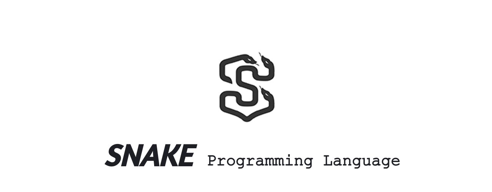

SNAKE is a Concatenative Stack-Oriented Programming Language for Computers.
This will be updated soon

## What is a Stack-based programming language?

A stack-based programming language is a language that uses a stack to store and manipulate data during program execution. The stack is a data structure that operates on the Last-In-First-Out (LIFO) principle, that is, the last element inserted into the stack is the first to be removed.

This approach is commonly used in functional programming languages, such as the Forth language and HP's RPL language, which are designed for programming on HP calculators. It is also commonly used in other programming languages, such as PostScript and assembly.

A stack-based programming language is useful in situations where the execution stack is a natural and efficient way to store and manipulate data. For example, it can be used to simplify the implementation of mathematical calculations, which involve a series of operations that are performed on a stack of data. In addition, the stack approach can be used to simplify the flow control of a program, since the stack manipulation can be used to control the execution of subroutines and loops in a very efficient way.

**WARNING! THIS LANGUAGE IS A WORK IN PROGRESS! ANYTHING CAN CHANGE AT ANY MOMENT WITHOUT ANY NOTICE! USE THIS LANGUAGE AT YOUR OWN RISK!**
